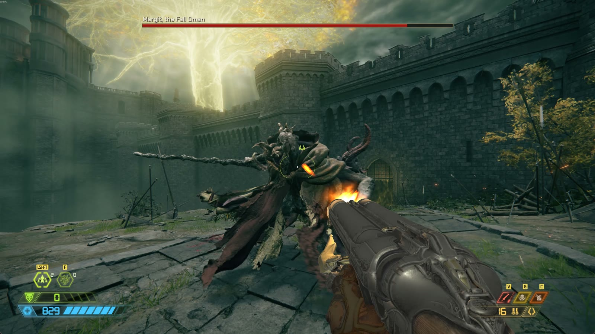
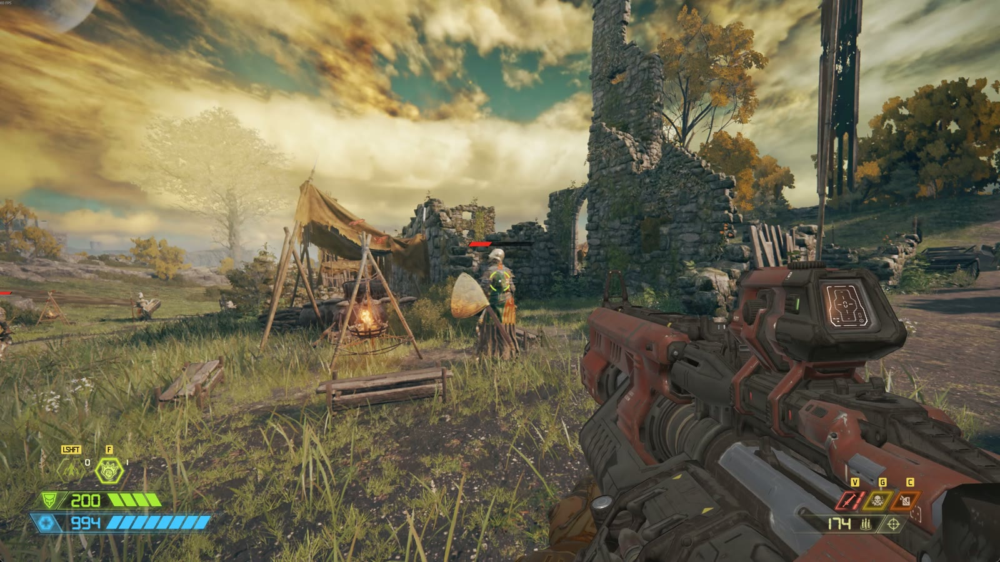
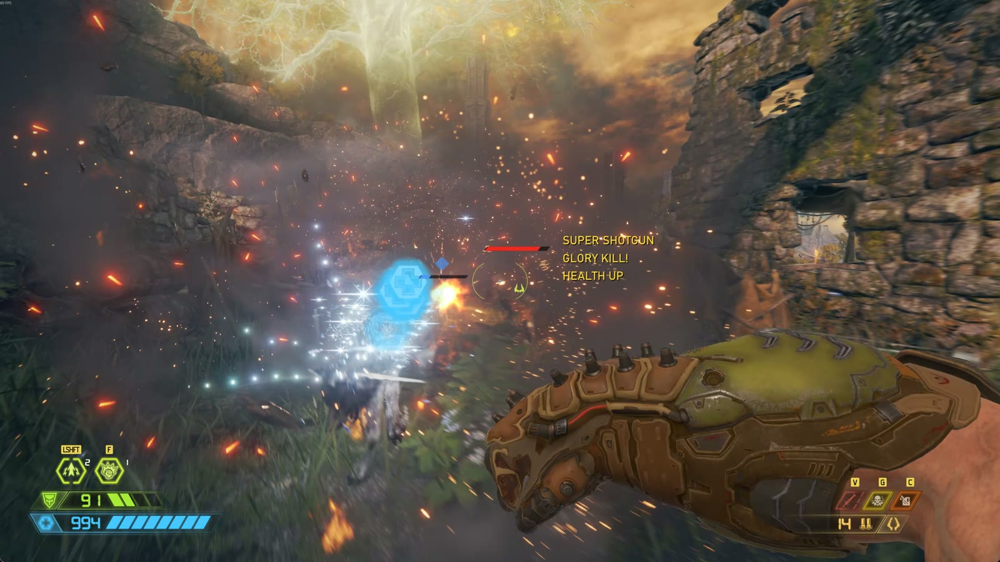
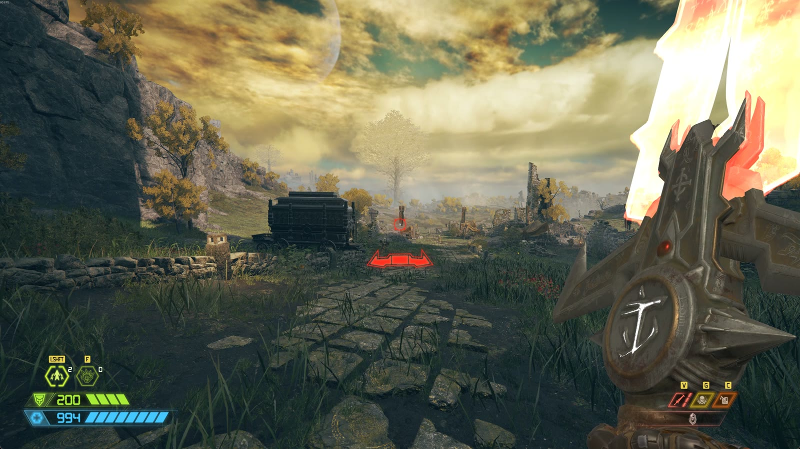
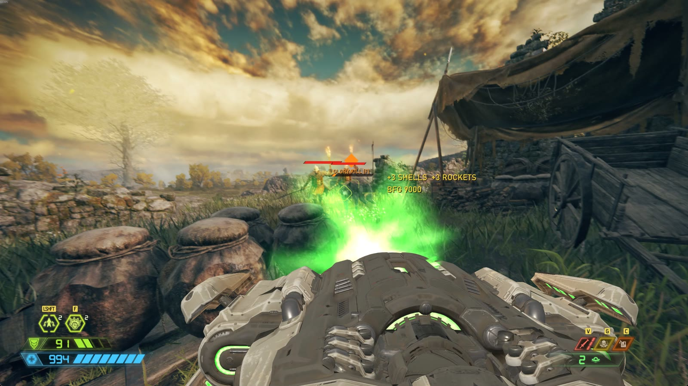
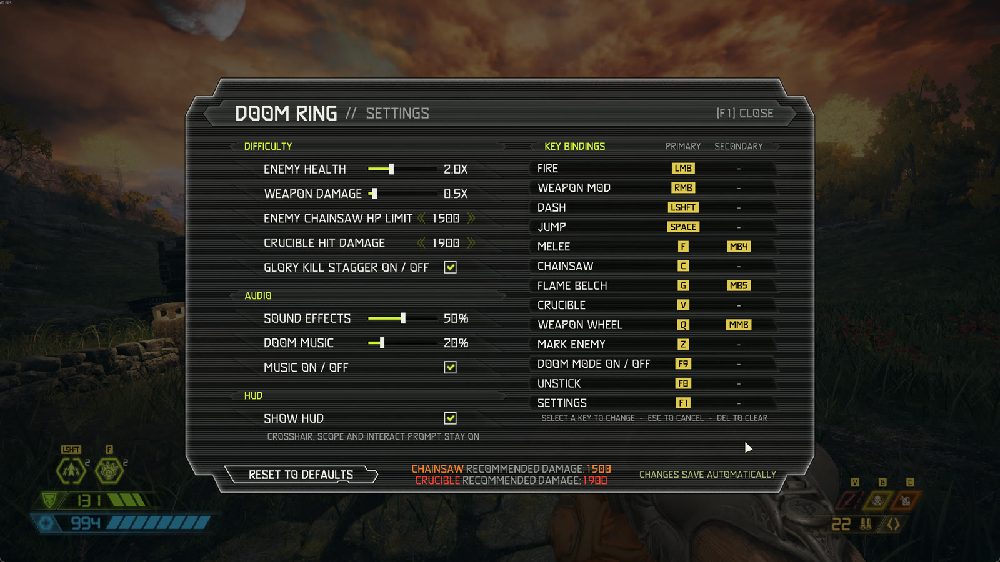

# DOOM RING

DOOM Eternal's guns, HUD, sounds and combat music inside ELDEN RING: Doom movement (dash, double
jump), glory kills, chainsaw, Blood Punch, Flame Belch, the Crucible, and 8 of DOOM Eternal's combat
suites played by Doom's own music rules.

> **Unofficial fan mod.** Not affiliated with or endorsed by id Software, Bethesda, FromSoftware or
> Bandai Namco. DOOM Eternal © id Software / Bethesda. ELDEN RING © FromSoftware / Bandai Namco.

## Requirements

**Both games must be installed on your PC through Steam:**
- **ELDEN RING** (base game, app version 2.7.1);
- **DOOM Eternal** (base game; no DLC is used).

The setup reads DOOM Eternal's files to build the mod, so DOOM Eternal has to stay installed while
you install or update DOOM RING. Windows 10/11 and about 3 GB of free space are needed while installing.

## Gameplay

You play ELDEN RING in first person as the Doom Slayer:

- **Doom movement.** Fast ground movement, double jump with air control, and a dash.
- **8 Doom weapons** with their first-person arms and animations and recoil. Switch with the number
  keys or the **weapon wheel**, which slows the game while it's open.
- **Doom HUD.** Health, armor, ammo, dash and equipment. ELDEN RING's own HUD is hidden.
- **DOOM Eternal's combat music.** 8 of DOOM Eternal's level suites, played by Doom's own music rules.
  The music starts when a fight starts and fades out after it ends.
- **Doom pickups.** Enemies drop Doom ammo and health. Burning enemies drop shield. Walk over a pickup
  to collect it automatically.

### Weapons and their right-click mods

| Slot | Weapon | Right click |
|---|---|---|
| 1 | Combat Shotgun | **Sticky Bombs**: 5 per load, they stick to enemies and explode, then reload by themselves |
| 2 | Heavy Cannon | **Precision Bolt**: a scope for a heavy, precise shot (a killing bolt just kills, no stagger) |
| 3 | Plasma Rifle | **Heat Blast**: firing builds heat in 3 levels; right click releases it as a shockwave |
| 4 | Rocket Launcher | **Remote Detonate**: blows your newest rocket up mid-flight. The blast staggers enemies, with extra explosions when it's near them |
| 5 | Super Shotgun | **Meathook**: pulls you to an enemy (30 m reach, 3 s cooldown) |
| 6 | Ballista | **Arbalest**: hold to draw and charge, release to fire a bolt that sticks and explodes |
| 7 | Chaingun | **Mobile Turret**: hold to unfold three barrels for much faster fire while you walk slower |
| 8 | BFG 9000 | (none) |

### The Doom Slayer's tools

- **Glory kills.** Hurt an enemy enough and it staggers. Melee it to glory kill it with a
  finisher. A glory kill restores health and charges the Blood Punch.
- **Chainsaw.** Insta kills normal enemies and showers you with ammo for every gun. Chainsaw refuels
  over time. Very tough enemies can't be chainsawed: the limit is the **ENEMY CHAINSAW HP LIMIT** in
  the settings window.
- **Flame Belch.** Sets the enemies in front of you on fire. Damaging a burning enemy makes it drop
  shield. It recharges after use.
- **Blood Punch.** Each glory kill gives a charge (up to 2). Your next melee becomes a shockwave
  punch that hits everything in front of you and kills outright.
- **The Crucible.** Doom's blade (draw it with **V**). It kills an enemy in one swing and uses 1 to 3
  charges depending on how tough the enemy is (**CRUCIBLE HIT DAMAGE** in the settings). It holds up
  to 3 charges.
- **Punches.** A plain melee punch when nothing is staggered.

### Rules changed to fit ELDEN RING

- **Bosses can't be cheesed.** Any enemy with a boss bar, its mount included, can't be chainsawed,
  glory killed, Crucibled or killed by a Blood Punch.
- **Out of ammo at a boss?** Chainsaw the boss: every gun is refilled, and the boss takes no damage.
- **Bosses give a Crucible charge.** Every boss you defeat gives 1 Crucible charge with your next
  pickup. A boss with several stages (like Rennala) gives one, and duo bosses give one each.
- **Crucible charges are rare.** Besides bosses, a charge comes with about 1 in 80 pickups.
- **Your level counts.** Doom damage grows 1% per character level from level 9, and shrinks 1% per
  level below it. The recommended chainsaw limit and Crucible hit damage grow with it in steps of 100.
  The settings window shows the recommended values.
- **Difficulty.** Enemies have 2x health and Doom weapons do 0.5x damage by default, so fights last.
  You can change both in the settings window.
- **Armor shield.** Doom armor (up to 200) sits on top of your ELDEN RING health and takes hits first.
- **Each character keeps its own kit.** Doom ammo, armor, charges and health are saved per character.
  A new character starts with the full Doom kit.

### How it fits into ELDEN RING

- **First person** through our fork of Dasaav's [erfps2](https://github.com/Dasaav-dsv/erfps2). Lock-on
  with nothing targeted switches between first and third person.
- **Your character's body, weapons and HUD are hidden.** Its shadow stays, and ELDEN RING's boss bars
  are redrawn in the Doom HUD's style.
- **Doom mode on / off.** **F9** turns the Doom layer off for plain ELDEN RING, and on again.
- **Its own save.** DOOM RING plays on `DOOMRING.sl2` and never touches your normal ELDEN RING save.
- **Unstick.** Doom movement can push you into a wall or floor. **F8** lifts you out.
- **Mark an enemy.** **Z** gives the enemy under your crosshair a health bar. Press it again to remove it.

## Keys

Every key can be changed in the settings window (**F1**), with a primary and a secondary key for each
action plus a controller button.

| Action | Keyboard / mouse | Controller (Xbox / PlayStation) |
|---|---|---|
| Fire | Left mouse | RT / R2 |
| Weapon mod (right-click ability) | Right mouse | LT / L2 |
| Jump / double jump | Space | A / Cross |
| Dash | Left Shift | B / Circle |
| Melee (punch, glory kill, Blood Punch) | F / Mouse back button | RS click / R3 |
| Chainsaw | C | LB / L1 |
| Flame Belch | G / Mouse forward button | Y / Triangle |
| Crucible (draw / put away) | V | D-pad up |
| Weapon wheel (hold) / last weapon (tap) | Q / Middle mouse | RB / R1 (hold, right stick picks) |
| Weapons 1-8 | 1-8 | weapon wheel |
| Interact (ELDEN RING's) | E | X / Square |
| Mark enemy | Z | D-pad down |
| Unstick | F8 | D-pad left |
| Doom mode on / off | F9 | D-pad right |
| Settings window | F1 | View / Create |

**Controller notes**
- Xbox controllers work directly. PlayStation controllers work through Steam Input, and PlayStation
  icons show when a Sony controller is connected.
- The HUD and the settings window switch to button icons as soon as you use the controller.
- **Turn off** ELDEN RING's *System > Camera > "Camera Auto Rotation"* and *"Auto Wall Recovery"*:
  with them on, the controller camera feels uneven with the Doom movement.
- Click into the game window once after it starts; the Windows cursor can block the controller until
  it hides.

## The settings window (F1)

Changes save automatically.

| Setting | What it does |
|---|---|
| **DIFFICULTY**: Enemy health | ELDEN RING enemies' health, x the game's (default 2x). Applies after a game restart |
| **DIFFICULTY**: Weapon damage | Doom weapons' damage (default 0.5x) |
| **ENEMY CHAINSAW HP LIMIT** | Enemies this tough or tougher can't be chainsawed. The recommended value for your level is shown |
| **CRUCIBLE HIT DAMAGE** | How tough an enemy can be for a 1-charge Crucible kill (2x for 2 charges, more for 3). The recommended value for your level is shown |
| **AUDIO**: Sound effects, Doom music, Music on / off | volumes and music |
| **GLORY KILL STAGGER ON / OFF** | Off: enemies don't stop at the stagger, they just die |
| **SHOW HUD** | The Doom HUD on or off (the crosshair, scope and interact prompt stay) |
| **KEY BINDINGS** | Primary, secondary and controller key for every action |
| **RESET TO DEFAULTS** | Back to the standard values |

On a controller: left stick = cursor, A = click, B = close.

## More settings: `doomslayer.toml`

Everything else is in two text files in your install folder. Open them with Notepad. Most changes
apply while the game runs (checked every second).

- `game\natives\doomslayer.toml`: DOOM RING
- `game\natives\erfps2.toml`: the first-person camera (field of view and more)

The setup keeps both files when you update. Some of what you can change in `doomslayer.toml`:

| Group | Settings |
|---|---|
| **Movement** | `ground_speed`, `ground_accel`, `ground_friction`, `move_speed_mult`, `jump_height`, `double_jump_height`, `double_jump_push`, `air_gravity`, `air_control`, `doom_move` (Doom movement on / off) |
| **Dash** | `dash_distance`, `dash_time`, `dash_recharge` (seconds per charge) |
| **Landing** | `land_bounce` (Doom's landing dip: depth, down, up), `land_settle`, `land_min_drop` |
| **Glory kills** | `glory_kills`, `stagger_hp_frac` (health share where enemies stagger), `glory_range`, `glory_heal_frac`, `glory_teleport` (teleport to the enemy instead of the lunge) |
| **Chainsaw / Crucible** | `chainsaw_range`, `crucible_range`, `crucible_swing_speed`, `crucible_hp` |
| **Damage and health** | `weapon_damage_mult`, `enemy_hp_mult`, `level_damage`, `level_base`, `armor_max`, `armor_absorb`, `max_health`, `infinite_ammo` |
| **Weapons** | `switch_fire_delay`, `meathook_range`, `meathook_speed`, `ballista_aim_look` (mouse speed while aiming the Ballista) |
| **Gun view** | `vm_fov` (gun field of view), `vm_offset`, `sway`, `bob_mode` (Doom's own bob or ours), `doom_bob`, `doom_bob_move`, `doom_bob_rot`, `bob`, `bob_tip`, `bob_noise`, `aim_steady`, `vm_msaa` / `vm_fxaa` (anti-aliasing) |
| **Melee view** | `melee_fov`, `melee_arm_push` |
| **Audio** | `volume`, `music`, `music_volume`, `music_hold` (seconds before the music fades), `[sound_db]` (volume per sound, in dB) |
| **HUD and game** | `show_hud`, `hide_er_hud`, `hide_body`, `wheel_slowmo` (game speed with the weapon wheel open) |
| **Keys** | `[keys]`: Windows key codes (easier to change in the settings window) |

Every line in the file has a short comment that says what it does.

## Made and tested by people and Claude, not by generative AI slop

- **No generative AI was used for any visual or audio asset.** Every gun, arm, animation, texture,
  HUD element, sound and piece of music in DOOM RING is DOOM Eternal's own, converted from your own
  install by the setup.
- **The code and the mod description text were written with [Claude Code](https://claude.com/claude-code)**
  (Anthropic), under the author's direction. It went through intensive human bug testing and beta testing. So it's not just an
  "ask AI to put DOOM in ELDEN RING" mod: it's a mod that has taken several days to refine, to make it
  play and feel like DOOM.

## No game files here: bring your own

This repository holds **code only**. It contains no DOOM Eternal or ELDEN RING files and no files
converted from them. The setup builds DOOM RING's DOOM content on your PC from **your own** DOOM
Eternal install, like other "bring your own game files" projects.

You need:
- Windows 10/11 and Steam;
- ELDEN RING (base game, app version 2.7.1);
- DOOM Eternal (base game; no DLC is used);
- about 3 GB of free space while installing.

## Install

1. Download the newest DOOM RING Setup zip from [Releases](../../releases) and unzip it.
2. Run `Setup DOOM RING.exe`. It finds both games through Steam and builds the mod (5-20 minutes).
   Command windows may flash while it runs; that's normal.
3. Start the game with **Play DOOM RING** (desktop shortcut or the .bat in the install folder).

To update, run the new version's setup and keep the same folder. It finds your install and updates
it, keeping your settings, keys and progress.

## Offline only

DOOM RING runs ELDEN RING **offline** with Easy Anti-Cheat off, through the me3 mod loader, as every
ELDEN RING mod of this kind does. It uses its own save file (`DOOMRING.sl2`) and never touches your
normal save. **Never take a modded game online.**

## What's in here

| Folder | What |
|---|---|
| `doomslayer/` | the mod: a Rust DLL loaded by me3 (Doom movement, weapons, HUD, music, settings window) |
| `erfps2/` | our fork of Dasaav's [erfps2](https://github.com/Dasaav-dsv/erfps2) first-person camera (eye-height lock) |
| `tools/` | converters that read DOOM Eternal's files: sounds and music (`.snd`, Wwise), HUD textures, fonts, guns / arms / animations (md6 meshes, skeletons, animations) |
| `installer/` | the setup: wizard (Python / tkinter), engine, package builder, Rust launcher |
| `docs/` | file format notes (`md6_formats.md`), DOOM's music system, the installer |
| `vendor/hudhook/` | hudhook (MIT), the D3D12 overlay library |
| `dist/`, `portable-template/` | the me3 launch profile and default settings |

Building from source: see [BUILDING.md](BUILDING.md).

## Credits

See [CREDITS.txt](installer/licenses/CREDITS.txt). In short:
- [me3](https://github.com/garyttierney/me3) (mod loader);
- [erfps2](https://github.com/Dasaav-dsv/erfps2) by Dasaav;
- [fromsoftware-rs](https://github.com/Dasaav-dsv/fromsoftware-rs);
- [hudhook](https://github.com/veeenu/hudhook) with MinHook;
- [SAMUEL](https://github.com/brongo/SAMUEL) (GPL-3.0; the setup ships it as `samuel-cli`);
- ww2ogg (BSD-3) and ffmpeg (GPL v3), used by the setup;
- the Chakra Petch font (SIL OFL).

**Made with AI.** DOOM RING's code was written with Claude (Anthropic) under the author's direction
and testing. No AI-generated assets were used in the production of this mod. All sounds, music,
textures and icons are from DOOM Eternal.

## Licence

DOOM RING's own code: MIT ([LICENSE](LICENSE)). The erfps2 fork, fromsoftware-rs, hudhook and the
setup tools keep their own licences (in their folders and in `installer/licenses`).
